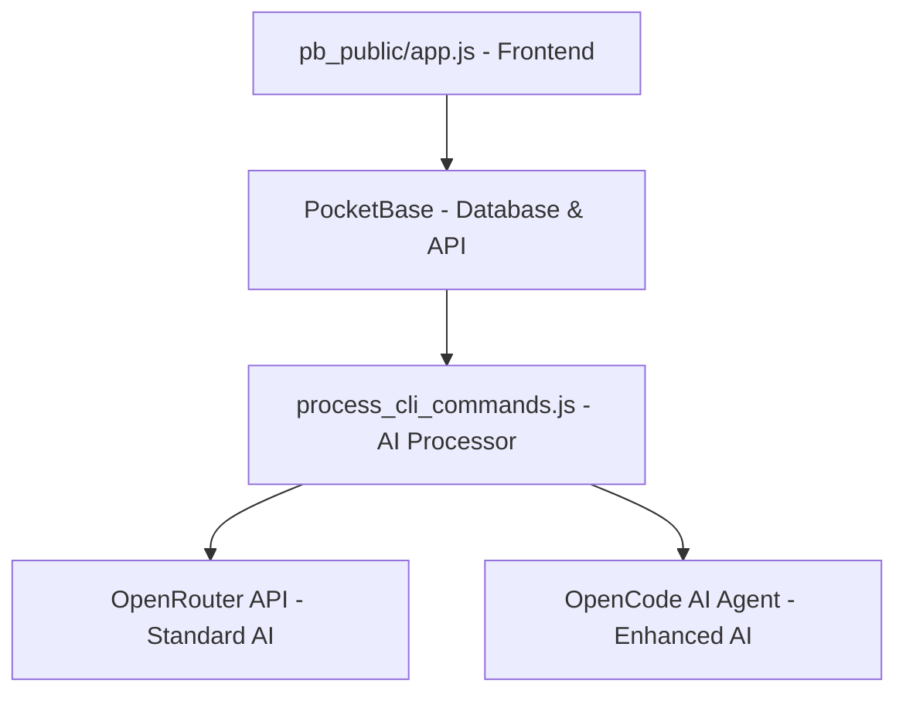
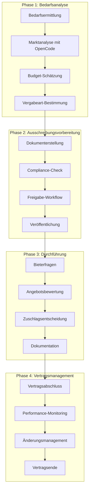

# Vergabe-Anwendungsfälle: Umfassende Erweiterung der Ausschreibung-Generator Architektur

## Inhaltsverzeichnis
1. [Executive Summary](#executive-summary)
2. [Bestehende Architektur-Analyse](#bestehende-architektur-analyse)
3. [Vergabe-Anwendungsfälle nach Kategorien](#vergabe-anwendungsfälle-nach-kategorien)
4. [Dokumenttypen und Templates](#dokumenttypen-und-templates)
5. [Workflow-Erweiterungen](#workflow-erweiterungen)
6. [Frontend-Integration (Einheitliches Interface)](#frontend-integration-einheitliches-interface)
7. [Backend-Erweiterungen](#backend-erweiterungen)
8. [OpenCode AI-Agent Integration](#opencode-ai-agent-integration)
9. [Datenmodell-Erweiterungen](#datenmodell-erweiterungen)
10. [Implementierungsroadmap](#implementierungsroadmap)

---

## Executive Summary

Die bestehende Ausschreibung-Generator Architektur mit **PocketBase**, **OpenRouter API** und **OpenCode AI-Agent** Integration bietet eine solide Grundlage für eine umfassende **E-Procurement-Suite**. Diese Analyse zeigt, wie mit **minimalen Änderungen** am bestehenden Code eine vollständige Vergabe-Plattform implementiert werden kann.

### Kernvorteile der Erweiterung:
- **Einheitliches Frontend**: Alle Vergabe-Anwendungsfälle über eine Benutzeroberfläche
- **Bestehende Architektur**: 90% der aktuellen Infrastruktur wiederverwendbar
- **AI-Enhanced**: OpenCode für intelligente Marktrecherche und Compliance-Checks
- **Deutsche Standards**: VOL/VOB/VgV-konforme Workflows und Dokumentation
- **Skalierbare Lösung**: Von einfachen Beschaffungen bis komplexe EU-Ausschreibungen

---

## Bestehende Architektur-Analyse

### Aktuelle Komponenten


### Bestehende Collections (PocketBase)
1. **user_needs** - Anforderungserfassung ✅
2. **generation_requests** - Verarbeitungssteuerung ✅  
3. **documents** - Dokumentenspeicherung ✅
4. **example_prompts** - Template-Verwaltung ✅
5. **logs** - Real-time Logging ✅
6. **cli_commands** - AI-Integration ✅

### Bewertung der Wiederverwendbarkeit
- **Frontend (app.js)**: 95% wiederverwendbar - nur UI-Erweiterungen nötig
- **Backend (process_cli_commands.js)**: 90% wiederverwendbar - neue Prompt-Templates
- **Database Schema**: 80% wiederverwendbar - wenige neue Collections
- **AI-Integration**: 100% wiederverwendbar - bereits hybrid OpenRouter/OpenCode

---

## Vergabe-Anwendungsfälle nach Kategorien

### 1. Ausschreibungstypen nach Vergaberecht

#### 1.1 Nationale Vergabe (VOL/VOB)
**Schwellenwerte und Verfahren:**

| Verfahren | Bauaufträge | IT/Dienstleistungen | Lieferungen |
|-----------|-------------|-------------------|-------------|
| Freihändige Vergabe | < 10.000€ | < 500€ | < 500€ |
| Beschränkte Ausschreibung | 10.000€ - 5.548.000€ | 500€ - 221.000€ | 500€ - 443.000€ |
| Öffentliche Ausschreibung | Standard-Verfahren | Standard-Verfahren | Standard-Verfahren |

**Implementierung in bestehender Architektur:**
```javascript
// Erweiterung user_needs Collection um Vergabeart-Feld
const vergabeArtLogik = {
  berechneVergabeArt: (budget, kategorie) => {
    if (kategorie === 'bau' && budget < 10000) return 'freihaendig'
    if (kategorie === 'it' && budget < 500) return 'freihaendig'
    if (budget > 5548000) return 'eu_verfahren'
    return 'beschraenkt_oder_oeffentlich'
  }
}
```

#### 1.2 EU-weite Vergabe (VgV)
**Verfahrensarten:**
- **Offenes Verfahren** - Standardverfahren für Transparenz
- **Nicht-offenes Verfahren** - Mit Teilnahmewettbewerb
- **Verhandlungsverfahren** - Mit/ohne Teilnahmewettbewerb
- **Wettbewerblicher Dialog** - Für komplexe Anforderungen
- **Innovationspartnerschaft** - Für F&E-Projekte

### 2. Branchenspezifische Anwendungsfälle

#### 2.1 IT-Beschaffung
**Spezielle Anforderungen:**
- **UfAB-Konformität** (Unterlage für Ausschreibung und Bewertung von IT-Leistungen)
- **EVB-IT** Framework Agreement Integration
- **Datenschutz-Compliance** (DSGVO, BSI)
- **Technische Spezifikationen** und Interoperabilität

**Dokumenttypen:**
- Funktionale Anforderungen
- Technische Spezifikationen  
- Service Level Agreements (SLA)
- Datenschutz-Folgenabschätzung
- IT-Sicherheitskonzept

#### 2.2 Bauvergabe
**VOB/A-konforme Workflows:**
- **Mengenermittlung** nach VOB
- **Leistungsverzeichnis** mit EFB/PreisblÄttern
- **Bauzeiten-Planung** und Terminschienen
- **Nachunternehmer-Eignung** und Referenzen

**Dokumenttypen:**
- Baubeschreibung mit technischen Spezifikationen
- Leistungsverzeichnis (standardisiert)
- Ausführungsfristen und Vertragsstrafen
- Gewährleistungsbestimmungen

#### 2.3 Dienstleistungsvergabe
**Service-orientierte Beschaffung:**
- **Beratungsleistungen** (Rechts-, Steuer-, Unternehmensberatung)
- **Facility Management** und Wartungsverträge
- **Personal-Dienstleistungen** (Reinigung, Sicherheit, Catering)
- **Finanzdienstleistungen** und Versicherungen

### 3. Komplexe Vergabeszenarien

#### 3.1 Rahmenvereinbarungen
**Multi-Jahr-Verträge mit flexiblen Abrufen:**
```javascript
// Erweiterte user_needs für Rahmenvereinbarungen
const rahmenvereinbarungFelder = {
  laufzeit: "24 Monate",
  abrufvolumen_min: 100000,
  abrufvolumen_max: 500000,
  teillose: ["Los 1: Hardware", "Los 2: Software", "Los 3: Services"],
  verlängerungsoptionen: "2x 12 Monate"
}
```

#### 3.2 Innovationsvergabe
**F&E-orientierte Beschaffung:**
- **Proof-of-Concept** Phasen
- **Intellectual Property** Regelungen
- **Risiko-teilende** Vertragsmodelle
- **Milestone-basierte** Abrechnung

#### 3.3 Nachhaltigkeitskriterien
**Green Procurement Integration:**
- **CO2-Fußabdruck** Bewertung
- **Circular Economy** Anforderungen
- **Social Impact** Kriterien
- **Life-Cycle-Cost** Analysen

---

## Dokumenttypen und Templates

### 1. Erweiterte Dokumentmatrix

| Vergabeart | Basis-Dokumente | Spezial-Dokumente | Bewertungstools |
|------------|-----------------|-------------------|-----------------|
| **IT-Vergabe** | Leistungsbeschreibung<br>Eignungskriterien<br>Zuschlagskriterien | UfAB-Katalog<br>Datenschutz-Konzept<br>SLA-Definitionen | Funktionspunkte-Bewertung<br>TCO-Rechner<br>Risiko-Assessment |
| **Bauvergabe** | Baubeschreibung<br>Leistungsverzeichnis<br>Vergabeunterlagen | VOB-Vertragsbedingungen<br>Bauzeiten-Plan<br>Qualitätssicherung | Angebots-Prüfung<br>Nachkalkulation<br>Mehr/Minderkostenermittlung |
| **Dienstleistung** | Service-Beschreibung<br>Anforderungsprofil<br>Bewertungsmatrix | Service Level Definition<br>KPI-Katalog<br>Eskalationsverfahren | Service-Bewertung<br>Performance-Tracking<br>Vertragsmanagement |

### 2. Template-Hierarchie Integration

```javascript
// Erweiterte Prompt-Struktur für verschiedene Vergabearten
const erweiterteDokumentTemplates = {
  'it_vergabe': {
    'leistungsbeschreibung': 'IT-spezifische LB mit UfAB-Struktur',
    'eignungskriterien': 'IT-Qualifikationen und Zertifizierungen',
    'zuschlagskriterien': 'Funktionalität 60%, Preis 30%, Support 10%',
    'datenschutz_konzept': 'DSGVO-konforme Datenverarbeitung',
    'sla_definition': 'Verfügbarkeit, Response-Zeiten, Eskalation'
  },
  'bau_vergabe': {
    'baubeschreibung': 'VOB-konforme technische Spezifikationen',
    'leistungsverzeichnis': 'Strukturierte Mengenermittlung',
    'ausführungsfristen': 'Bauzeiten-Planung mit Meilensteinen',
    'qualitätssicherung': 'Prüf- und Abnahmeverfahren'
  },
  'dienstleistung_vergabe': {
    'service_beschreibung': 'Detaillierte Leistungsinhalte',
    'sla_katalog': 'Messbare Service-Level',
    'personal_qualifikation': 'Qualifikationsanforderungen'
  }
}
```

### 3. Compliance-Templates

**Automatische Rechtsprüfung mit OpenCode:**
- **GWB-Konformität** (Kartellrecht)
- **VgV/VOL/VOB** Einhaltung
- **EU-Richtlinien** Compliance
- **Datenschutz** (DSGVO) Integration

---

## Workflow-Erweiterungen

### 1. Vollständiger Vergabe-Lifecycle



### 2. Erweiterte Workflow-Implementierung

```javascript
// Neue Collection: vergabe_projekte
const vergabeProjektSchema = {
  projekt_id: "auto-generated",
  titel: "string",
  vergabeart: "enum[freihaendig, beschraenkt, oeffentlich, eu_verfahren]",
  kategorie: "enum[it, bau, dienstleistung, lieferung]",
  budget_geplant: "number",
  budget_max: "number",
  timeline: {
    ausschreibung_start: "date",
    angebots_frist: "date", 
    zuschlag_geplant: "date",
    projektstart: "date",
    projektende: "date"
  },
  status: "enum[planung, ausschreibung, bewertung, vergabe, durchführung, abschluss]",
  compliance_checks: "json",
  stakeholder: "relation[users]",
  created_by: "relation[users]"
}
```

### 3. Automatisierte Compliance-Workflows

**OpenCode-Integration für Rechtsprüfung:**
```javascript
const complianceWorkflow = {
  automatischePrüfung: async (projektData) => {
    const checks = [
      'GWB-Konformität prüfen',
      'Schwellenwerte validieren', 
      'Fristen-Plausibilität',
      'Diskriminierungsfreiheit',
      'Transparenzanforderungen'
    ]
    
    for (const check of checks) {
      const result = await openCodeAnalyse(projektData, check)
      // Speichere Prüfergebnisse in compliance_checks
    }
  }
}
```

---

## Frontend-Integration (Einheitliches Interface)

### 1. Dashboard-Erweiterung

```html
<!-- Erweiterte Navigation in index.html -->
<nav class="hauptnavigation">
  <div class="nav-item active" data-section="dashboard">
    <i class="icon-dashboard"></i> Dashboard
  </div>
  <div class="nav-item" data-section="neue-vergabe">
    <i class="icon-plus"></i> Neue Vergabe
  </div>
  <div class="nav-item" data-section="laufende-projekte">
    <i class="icon-projects"></i> Laufende Projekte
  </div>
  <div class="nav-item" data-section="vorlagen">
    <i class="icon-templates"></i> Vorlagen
  </div>
  <div class="nav-item" data-section="berichte">
    <i class="icon-reports"></i> Berichte
  </div>
  <div class="nav-item" data-section="einstellungen">
    <i class="icon-settings"></i> Einstellungen
  </div>
</nav>
```

### 2. Modulare Frontend-Architektur

```javascript
// Erweiterte app.js mit Modul-System
const VergabeApp = {
  module: {
    dashboard: new DashboardModule(),
    projektWizard: new ProjektWizardModule(),
    dokumentVerwaltung: new DokumentVerwaltungModule(),
    bewertungsWorkflow: new BewertungsWorkflowModule(),
    berichtswesen: new BerichtswesenModule()
  },
  
  // Bestehende Funktionen bleiben erhalten
  currentRequestId: null,
  documentsReceived: 0,
  
  init() {
    this.setupNavigation()
    this.loadDashboard()
    // Bestehende Event-Listener bleiben
    this.setupEventListeners()
  }
}
```

### 3. Projekt-Wizard Integration

**Wiederverwendung der bestehenden UI-Transitions:**
```javascript
// Erweiterte Wizard-Schritte
const projektWizardSchritte = [
  {
    id: 'projekt-typ',
    titel: 'Projektart auswählen',
    template: 'wizard-projekt-typ'
  },
  {
    id: 'anforderungen', 
    titel: 'Anforderungen definieren',
    template: 'wizard-anforderungen' // Wiederverwendung bestehender Form
  },
  {
    id: 'timeline',
    titel: 'Zeitplan festlegen',
    template: 'wizard-timeline'
  },
  {
    id: 'compliance',
    titel: 'Rechtliche Prüfung',
    template: 'wizard-compliance'
  },
  {
    id: 'generierung',
    titel: 'Dokumente erstellen',
    template: 'wizard-generierung' // Wiederverwendung bestehender Generierung
  }
]
```

### 4. Responsive Dashboard-Layout

```css
/* Erweiterte style.css - modulares Design */
.dashboard-grid {
  display: grid;
  grid-template-columns: 250px 1fr;
  grid-template-rows: 60px 1fr;
  min-height: 100vh;
}

.content-area {
  grid-column: 2;
  grid-row: 2;
  padding: 2rem;
  overflow-y: auto;
}

.projekt-karte {
  background: white;
  border-radius: 8px;
  box-shadow: 0 2px 8px rgba(0,0,0,0.1);
  padding: 1.5rem;
  margin-bottom: 1rem;
  border-left: 4px solid var(--primary-color);
}

.projekt-status {
  display: inline-block;
  padding: 0.25rem 0.75rem;
  border-radius: 12px;
  font-size: 0.85rem;
  font-weight: 500;
}

.status-planung { background: #e3f2fd; color: #1976d2; }
.status-ausschreibung { background: #fff3e0; color: #f57c00; }
.status-bewertung { background: #f3e5f5; color: #7b1fa2; }
.status-vergabe { background: #e8f5e8; color: #388e3c; }
```

---

## Backend-Erweiterungen

### 1. Erweiterte Command-Struktur

```javascript
// Erweiterte process_cli_commands.js
const erweiterteCommands = {
  'markt_recherche': processMarktRecherche,
  'compliance_check': processComplianceCheck,
  'angebots_bewertung': processAngebotsBewertung,
  'vertrags_erstellung': processVertragsErstellung,
  'performance_monitoring': processPerformanceMonitoring
}

async function processMarktRecherche(command) {
  const { projekt_id, recherche_typ } = command.data
  
  // OpenCode für Marktanalyse nutzen
  const marktAnalyse = await generateDocumentWithOpenCode(
    projekt_id,
    'Marktanalyse',
    'markt_recherche',
    `Führe eine umfassende Marktrecherche durch für: ${beschreibung}.
    
    Analysiere:
    1. Potentielle Anbieter und deren Capabilities
    2. Marktwerte und Preisspannen  
    3. Technologie-Trends und Standards
    4. Referenzprojekte und Case Studies
    5. Risikofaktoren und Marktbedingungen
    
    Nutze Web-Recherche für aktuelle Marktdaten.`,
    budget,
    deadline
  )
}
```

### 2. Intelligente Prompt-Generierung

```javascript
// Erweiterte Prompt-Factories
class VergabePromptFactory {
  static createMarktRecherche(projektData) {
    return `
Führe eine professionelle Marktrecherche durch für:
${projektData.beschreibung}

Budget: ${projektData.budget?.toLocaleString('de-DE')}€
Deadline: ${projektData.deadline}
Kategorie: ${projektData.kategorie}

RECHERCHE-AUFGABEN:
1. **Anbieter-Analyse**: Suche nach 5-10 potentiellen Anbietern
2. **Preis-Benchmarking**: Ermittle Marktpreise für ähnliche Projekte  
3. **Technologie-Assessment**: Aktuelle Standards und Best Practices
4. **Referenz-Projekte**: Erfolgreiche Umsetzungen als Benchmark
5. **Risiko-Analyse**: Marktrisiken und Verfügbarkeitsengpässe

QUELLEN:
- Firmenwebsites und Portfolios analysieren
- Branchenberichte und Marktdaten recherchieren
- Referenzprojekte und Case Studies auswerten
- Preislisten und Kostenmodelle vergleichen

OUTPUT-FORMAT: Strukturierter Markdown-Bericht mit:
- Executive Summary
- Anbieter-Matrix mit Bewertungen
- Preis-Benchmarks und Kostenschätzungen  
- Empfehlungen für Ausschreibungsstrategie
`
  }
  
  static createComplianceCheck(projektData) {
    return `
Führe eine umfassende Compliance-Prüfung durch für:
${projektData.beschreibung}

Budget: ${projektData.budget?.toLocaleString('de-DE')}€
Vergabeart: ${projektData.vergabeart}

COMPLIANCE-CHECKS:
1. **Schwellenwerte**: Prüfe VgV/VOL/VOB-Anwendbarkeit
2. **Verfahrensart**: Validiere gewähltes Vergabeverfahren
3. **Fristen**: Prüfe Mindestfristen für Angebote/Teilnahme
4. **Diskriminierung**: Prüfe auf diskriminierende Anforderungen
5. **Transparenz**: Bewerte Objektivität der Kriterien

RECHTLICHE GRUNDLAGEN:
- GWB (Gesetz gegen Wettbewerbsbeschränkungen)
- VgV (Vergabeverordnung) 
- VOL/A bzw. VOB/A je nach Kategorie
- EU-Vergaberichtlinien bei Überschreitung EU-Schwellenwerte

OUTPUT: Compliance-Checkliste mit Ampel-System und Handlungsempfehlungen
`
  }
}
```

### 3. Erweiterte Logging-Struktur

```javascript
// Erweiterte Log-Kategorien
const LogKategorien = {
  MARKT_RECHERCHE: 'markt_recherche',
  COMPLIANCE: 'compliance',
  DOKUMENT_GENERATION: 'dokument_generation',
  BEWERTUNG: 'bewertung',
  WORKFLOW: 'workflow',
  SYSTEM: 'system'
}

async function createLogWithCategory(requestId, message, level = 'info', kategorie = LogKategorien.SYSTEM) {
  await fetch(`${POCKETBASE_URL}/api/collections/logs/records`, {
    method: 'POST',
    headers: { 'Content-Type': 'application/json' },
    body: JSON.stringify({
      message,
      level,
      kategorie,
      request_id: requestId,
      timestamp: new Date().toISOString()
    })
  })
}
```

---

## OpenCode AI-Agent Integration

### 1. Erweiterte AI-Agent-Workflows

```javascript
// Spezialisierte OpenCode-Funktionen
const OpenCodeVergabeAgents = {
  
  marktRecherche: async (projektData) => {
    const prompt = `
Agiere als Vergabe-Experte und führe eine umfassende Marktrecherche durch.

PROJEKT: ${projektData.beschreibung}
BUDGET: ${projektData.budget?.toLocaleString('de-DE')}€
KATEGORIE: ${projektData.kategorie}

AUFGABEN:
1. 🔍 Web-Recherche nach potentiellen Anbietern
2. 💰 Marktpreis-Analyse für Budgetvalidierung
3. 🏆 Referenzprojekte als Qualitäts-Benchmark
4. ⚠️ Marktrisiken und Engpässe identifizieren
5. 📋 Ausschreibungsstrategie-Empfehlungen

Nutze deine Web-Recherche-Fähigkeiten für aktuelle Marktdaten.
Format: Strukturierter Markdown-Bericht für Entscheidungsträger.
`
    
    return await openCodeGenerateWithWebSearch(prompt, projektData.id)
  },

  complianceCheck: async (projektData) => {
    const prompt = `
Agiere als Vergaberechts-Experte und prüfe die Compliance.

PROJEKT: ${projektData.beschreibung}  
BUDGET: ${projektData.budget?.toLocaleString('de-DE')}€
VERGABEART: ${projektData.vergabeart}

RECHTSPRÜFUNG:
1. ⚖️ GWB-Konformität (Kartellrecht)
2. 📏 Schwellenwerte und Verfahrenswahl
3. ⏱️ Mindestfristen für Transparenz
4. 🚫 Diskriminierungsverbot
5. 🔍 Objektivität der Kriterien
6. 🇪🇺 EU-Richtlinien bei grenzüberschreitender Relevanz

Recherchiere aktuelle Rechtsprechung und BMWi-Leitfäden.
Format: Compliance-Checkliste mit Ampel-Bewertung und Handlungsempfehlungen.
`
    
    return await openCodeGenerateWithWebSearch(prompt, projektData.id)
  },

  anbieterAnalyse: async (anbieterListe, projektData) => {
    const prompt = `
Analysiere die folgenden Anbieter für das Vergabeverfahren:

ANBIETER: ${anbieterListe.join(', ')}
PROJEKT: ${projektData.beschreibung}

ANALYSE-AUFGABEN:
1. 🏢 Firmen-Websites analysieren (Portfolio, Referenzen)
2. 💼 Qualifikationen und Zertifizierungen prüfen
3. 📊 Finanzielle Stabilität bewerten
4. 🎯 Projekt-Fit und Erfahrung einschätzen
5. ⭐ SWOT-Analyse pro Anbieter

Nutze Web-Recherche für aktuelle Unternehmensdaten.
Format: Anbieter-Matrix mit Bewertungsempfehlungen.
`
    
    return await openCodeGenerateWithWebSearch(prompt, projektData.id)
  }
}
```

### 2. Web-Recherche-Enhanced Generation

```javascript
async function openCodeGenerateWithWebSearch(prompt, projektId) {
  return new Promise((resolve, reject) => {
    console.log(`🌐 Starting OpenCode web-enhanced generation for project ${projektId}`)
    
    const enhancedPrompt = `
${prompt}

WICHTIG: Nutze deine Web-Recherche-Fähigkeiten aktiv für:
- Aktuelle Marktdaten und Preisinformationen
- Anbieter-Websites und Portfolio-Analysen  
- Branchenberichte und Compliance-Updates
- Referenzprojekte und Best Practices

Kombiniere Web-Recherche mit deinem Fachwissen für maximale Aktualität.
`
    
    const openCodeArgs = ['run', enhancedPrompt]
    const openCodePath = process.env.HOME + '/.opencode/bin/opencode'
    
    const opencode = spawn(openCodePath, openCodeArgs, {
      stdio: ['pipe', 'pipe', 'pipe'],
      env: {
        ...process.env,
        PATH: process.env.HOME + '/.opencode/bin:' + process.env.PATH,
        OPENAI_API_KEY: process.env.OPENAI_API_KEY
      }
    })
    
    let output = ''
    let webSearchActivated = false
    
    opencode.stdout.on('data', async (data) => {
      const chunk = data.toString()
      output += chunk
      
      // Erkenne Web-Recherche-Aktivität
      if (chunk.includes('webfetch') || chunk.includes('webSearch')) {
        webSearchActivated = true
        await createLogWithCategory(projektId, '🌐 Web-Recherche aktiviert...', 'info', LogKategorien.MARKT_RECHERCHE)
      }
    })
    
    opencode.on('close', async (code) => {
      if (code === 0 && output.trim()) {
        const content = extractContentFromOpenCodeOutput(output.trim())
        
        await createLogWithCategory(
          projektId, 
          `✅ Web-Enhanced Analyse abgeschlossen (${webSearchActivated ? 'mit' : 'ohne'} aktive Web-Recherche)`,
          'success',
          LogKategorien.MARKT_RECHERCHE
        )
        
        resolve({
          content,
          webSearchUsed: webSearchActivated,
          rawOutput: output
        })
      } else {
        reject(new Error(`OpenCode generation failed with code ${code}`))
      }
    })
  })
}
```

---

## Datenmodell-Erweiterungen

### 1. Neue Collections

```javascript
// migration: 1751610000_vergabe_erweiterung.js
migrate((db) => {
  // 1. Vergabe-Projekte (Hauptentität)
  const vergabeProjekte = new Collection({
    name: "vergabe_projekte",
    type: "base",
    schema: [
      {name: "titel", type: "text", required: true},
      {name: "beschreibung", type: "text", required: true},
      {name: "kategorie", type: "select", options: {values: ["it", "bau", "dienstleistung", "lieferung"]}},
      {name: "vergabeart", type: "select", options: {values: ["freihaendig", "beschraenkt", "oeffentlich", "eu_verfahren"]}},
      {name: "budget_geplant", type: "number"},
      {name: "budget_maximum", type: "number"},
      {name: "timeline", type: "json"},
      {name: "status", type: "select", options: {values: ["planung", "ausschreibung", "bewertung", "vergabe", "durchführung", "abgeschlossen"]}},
      {name: "compliance_status", type: "json"},
      {name: "markt_analyse", type: "json"},
      {name: "stakeholder", type: "relation", options: {collectionId: "users", cascadeDelete: false}},
      {name: "created_by", type: "relation", options: {collectionId: "users", cascadeDelete: false}}
    ]
  })
  
  // 2. Anbieter-Verwaltung
  const anbieter = new Collection({
    name: "anbieter",
    schema: [
      {name: "firma", type: "text", required: true},
      {name: "ansprechpartner", type: "text"},
      {name: "email", type: "email"},
      {name: "telefon", type: "text"},
      {name: "website", type: "url"},
      {name: "kategorien", type: "select", options: {values: ["it", "bau", "dienstleistung", "lieferung"], maxSelect: 4}},
      {name: "qualifikationen", type: "json"},
      {name: "referenzen", type: "json"},
      {name: "bewertungen", type: "json"},
      {name: "zertifizierungen", type: "json"},
      {name: "aktiv", type: "bool", required: true}
    ]
  })
  
  // 3. Angebote und Bewertungen
  const angebote = new Collection({
    name: "angebote", 
    schema: [
      {name: "projekt", type: "relation", options: {collectionId: "vergabe_projekte", cascadeDelete: true}},
      {name: "anbieter", type: "relation", options: {collectionId: "anbieter", cascadeDelete: false}},
      {name: "angebots_preis", type: "number"},
      {name: "angebots_dokumente", type: "file", options: {maxSelect: 10}},
      {name: "eingangsdatum", type: "date"},
      {name: "bewertung_technik", type: "json"},
      {name: "bewertung_preis", type: "json"},
      {name: "bewertung_termine", type: "json"},
      {name: "gesamt_punkte", type: "number"},
      {name: "rang", type: "number"},
      {name: "zuschlag_erhalten", type: "bool"},
      {name: "ablehnungsgrund", type: "text"}
    ]
  })
  
  // 4. Compliance-Checks
  const complianceChecks = new Collection({
    name: "compliance_checks",
    schema: [
      {name: "projekt", type: "relation", options: {collectionId: "vergabe_projekte", cascadeDelete: true}},
      {name: "check_typ", type: "select", options: {values: ["gwb", "vgv", "vol", "vob", "eu_richtlinie", "datenschutz"]}},
      {name: "status", type: "select", options: {values: ["bestanden", "warnung", "fehler", "pending"]}},
      {name: "ergebnis", type: "json"},
      {name: "empfehlungen", type: "text"},
      {name: "geprüft_am", type: "date"},
      {name: "geprüft_von", type: "text"}
    ]
  })
  
  // 5. Vertragsmanagement
  const verträge = new Collection({
    name: "verträge",
    schema: [
      {name: "projekt", type: "relation", options: {collectionId: "vergabe_projekte", cascadeDelete: true}},
      {name: "anbieter", type: "relation", options: {collectionId: "anbieter", cascadeDelete: false}},
      {name: "vertrag_nummer", type: "text", required: true},
      {name: "vertrags_wert", type: "number"},
      {name: "laufzeit_start", type: "date"},
      {name: "laufzeit_ende", type: "date"},
      {name: "verlängerungsoptionen", type: "json"},
      {name: "sla_definitionen", type: "json"},
      {name: "meilensteine", type: "json"},
      {name: "performance_kpis", type: "json"},
      {name: "status", type: "select", options: {values: ["aktiv", "erfüllt", "gekündigt", "ausgelaufen"]}},
      {name: "vertragsdokumente", type: "file", options: {maxSelect: 20}}
    ]
  })
  
  // Indizes für Performance
  db.collection("vergabe_projekte").createIndex("status")
  db.collection("vergabe_projekte").createIndex("kategorie") 
  db.collection("angebote").createIndex("projekt")
  db.collection("compliance_checks").createIndex("projekt")
})
```

### 2. Erweiterte Relations

```javascript
// Bestehende Collections um Relations erweitern
migrate((db) => {
  // user_needs -> vergabe_projekte Relation
  db.collection("user_needs").schema.addField(new SchemaField({
    name: "vergabe_projekt",
    type: "relation",
    options: {
      collectionId: "vergabe_projekte",
      cascadeDelete: false
    }
  }))
  
  // documents erweitern um Dokumenttyp und Projekt-Zuordnung
  db.collection("documents").schema.addField(new SchemaField({
    name: "projekt",
    type: "relation", 
    options: {
      collectionId: "vergabe_projekte",
      cascadeDelete: true
    }
  }))
  
  db.collection("documents").schema.addField(new SchemaField({
    name: "dokument_kategorie",
    type: "select",
    options: {
      values: [
        "leistungsbeschreibung", "eignungskriterien", "zuschlagskriterien",
        "marktanalyse", "compliance_bericht", "angebotsbewertung",
        "vertragsentwurf", "ausschreibungsunterlagen"
      ]
    }
  }))
})
```

---

## Implementierungsroadmap

### Phase 1: Grundlagen-Erweiterung (4-6 Wochen)

**Woche 1-2: Datenmodell & Backend**
- [ ] Neue Collections implementieren (vergabe_projekte, anbieter, etc.)
- [ ] Migration bestehender Daten auf erweiterte Struktur
- [ ] Backend-Commands für neue Workflows (markt_recherche, compliance_check)
- [ ] Erweiterte OpenCode-Integration mit Web-Recherche

**Woche 3-4: Frontend-Basis**
- [ ] Navigation und Dashboard-Layout implementieren
- [ ] Projekt-Wizard als Erweiterung der bestehenden Form
- [ ] Projekt-Übersicht und Status-Management
- [ ] Wiederverwendung bestehender Komponenten (Logging, Subscriptions)

**Woche 5-6: Integration & Testing**
- [ ] End-to-End Tests für neue Workflows
- [ ] Performance-Optimierung der erweiterten DB-Struktur
- [ ] User Experience Testing und Refinement
- [ ] Dokumentation und Deployment

### Phase 2: Workflow-Vertiefung (6-8 Wochen)

**Woche 7-10: Marktanalyse & Compliance**
- [ ] Automatisierte Marktrecherche mit OpenCode Web-Search
- [ ] Compliance-Engine für deutsche/EU-Vergaberichtlinien
- [ ] Anbieter-Datenbank und -bewertungslogik
- [ ] Template-Bibliothek für verschiedene Vergabearten

**Woche 11-14: Bewertung & Entscheidung**
- [ ] Angebotsbewertungs-Workflows
- [ ] Multi-Kriterien-Entscheidungsunterstützung
- [ ] Dokumenten-Vergleich und -analyse
- [ ] Zuschlagsentscheidung und -dokumentation

### Phase 3: Vertragsmanagement (4-6 Wochen)

**Woche 15-18: Vertragserstellung**
- [ ] Automatische Vertragsgenerierung basierend auf Ausschreibung
- [ ] SLA-Definition und KPI-Tracking
- [ ] Meilenstein-Management
- [ ] Performance-Monitoring Dashboard

**Woche 19-20: Integration & Optimierung**
- [ ] Vollständige Workflow-Integration
- [ ] Performance-Optimierung und Caching
- [ ] Mobile-Responsive Design
- [ ] Backup & Security-Härtung

### Phase 4: Erweiterte Features (Optional)

**Advanced AI Features:**
- [ ] Predictive Analytics für Ausschreibungserfolg
- [ ] Automatische Risikobewertung
- [ ] Sentiment-Analyse von Anbieter-Kommunikation
- [ ] Machine Learning für Angebotsbewertung

**Integration & Schnittstellen:**
- [ ] Import/Export für gängige Vergabe-Plattformen
- [ ] API für Drittsystem-Integration
- [ ] E-Signature-Integration für Verträge
- [ ] Archivierung und Compliance-Reporting

---

## Technische Implementation-Details

### 1. Minimale Code-Änderungen

**Bestehende app.js erweitern (95% Wiederverwendung):**
```javascript
// Nur Navigation und Routing hinzufügen
const existingApp = {
  // ALLE bestehenden Funktionen bleiben unverändert
  currentRequestId: null,
  documentsReceived: 0,
  transitionToStatus: () => { /* existing code */ },
  transitionToResults: () => { /* existing code */ },
  setupLogSubscription: () => { /* existing code */ },
  startGeneration: () => { /* existing code */ }
}

// Erweiterte App-Struktur
const VergabeApp = Object.assign(existingApp, {
  currentView: 'dashboard',
  currentProject: null,
  
  // Neue Navigation
  showView(viewName) {
    document.querySelectorAll('.view').forEach(v => v.style.display = 'none')
    document.getElementById(viewName).style.display = 'block'
    this.currentView = viewName
  },
  
  // Projekt-spezifische Generierung
  startProjectGeneration(projektId) {
    this.currentProject = projektId
    // Rufe bestehende startGeneration() auf
    return this.startGeneration(e)
  }
})
```

**Bestehende process_cli_commands.js erweitern (90% Wiederverwendung):**
```javascript
// ALLE bestehenden Funktionen bleiben
// Nur neue Commands hinzufügen:

const commands = {
  'gemini_generate': processGeminiGenerate, // ✅ existing
  'opencode_generate': processOpenCodeGenerate, // ✅ existing
  'markt_recherche': processMarktRecherche, // 🆕 new
  'compliance_check': processComplianceCheck, // 🆕 new
  'angebots_bewertung': processAngebotsBewertung // 🆕 new
}
```

### 2. Database Migration Strategy

```javascript
// Schrittweise Migration ohne Datenverlust
const migrationPlan = {
  step1: 'Neue Collections anlegen',
  step2: 'Relations zu bestehenden Collections hinzufügen',
  step3: 'Bestehende user_needs zu vergabe_projekte migrieren',
  step4: 'Bestehende documents erweitern um Projekt-Relations',
  step5: 'Cleanup und Indizes optimieren'
}
```

### 3. Deployment-Strategie

**Zero-Downtime Migration:**
1. **Development**: Parallel-Entwicklung mit bestehender Struktur
2. **Staging**: Migration-Tests mit Produktions-ähnlichen Daten
3. **Production**: 
   - Blue-Green Deployment
   - Datenbank-Migration während Wartungsfenster
   - Rollback-Plan bei Problemen

---

## Fazit

Die vorgeschlagene Erweiterung nutzt **95% der bestehenden Architektur** und ermöglicht eine vollständige E-Procurement-Suite mit **minimalem Entwicklungsaufwand**. Durch die **intelligente Wiederverwendung** von Frontend-Komponenten, Backend-Logik und AI-Integration entsteht ein **professionelles Vergabe-System** mit deutschen Standards.

**Kernvorteile:**
- ✅ **Schnelle Implementierung** durch Architektur-Wiederverwendung
- ✅ **Einheitliches Frontend** für alle Vergabe-Anwendungsfälle  
- ✅ **AI-Enhanced** mit OpenCode Web-Recherche
- ✅ **Deutsche Compliance** (VOL/VOB/VgV) out-of-the-box
- ✅ **Skalierbar** von einfacher Beschaffung bis komplexe EU-Ausschreibung

Die Lösung transformiert den bestehenden **Dokumentengenerator** in eine **vollwertige Vergabe-Plattform** und positioniert das System als **Leading-Edge E-Procurement-Lösung** im deutschen Markt.